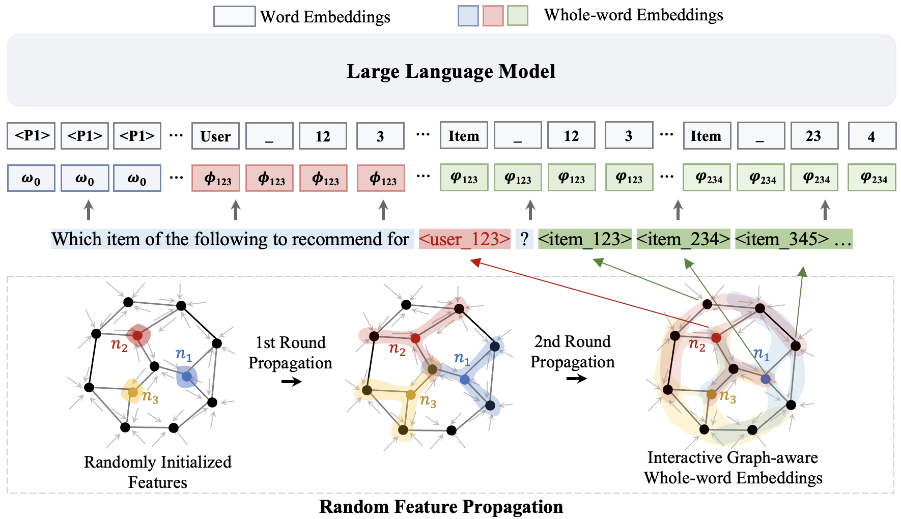

# ELMRec (EMNLP'24)
## Paper - [[ArXiv]](https://arxiv.org/pdf/2409.19979)
- Enhancing High-order Interaction Awareness in LLM-based Recommender Model, **EMNLP 2024 Main**.
- [**Xinfeng Wang**](https://wangxfng.github.io/), Jin Cui, Fumiyo Fukumoto, and Yoshimi Suzuki.

## Note
- The checkpoints of ELMRec were uploaded on [Google Drive](https://drive.google.com/drive/folders/131UDvFsUbJHr-G1um4XUNpMfvIJ54FMj?usp=sharing).
- If you have any questions, please feel free to contact me at kaysenn@163.com.

## Train and test ELMRec
### (1) Install requirements 
        >> pip install -r requirements.txt

### (2) Pretraining ({dataset}: beauty, sports, and toys.) (under ./ELMRec )
        >> python pretrain.py ./data/{dataset}/ --cuda --batch_size 64 --checkpoint ./checkpoint/{dataset}/

### (3) Inference ({dataset}: beauty, sports, and toys.) (under ./ELMRec )
        >> python seq_reranker.py ./data/{dataset}/ --cuda --batch_size 16 --checkpoint ./checkpoint/{dataset}/
        >> python topn.py ./data/{dataset}/ --cuda --batch_size 16 --checkpoint ./checkpoint/{dataset}/
        >> python exp.py ./data/{dataset}/ --cuda --batch_size 16 --checkpoint ./checkpoint/{dataset}/

## Parameters
<table>
  <tr>
    <th>Dataset</th>
    <th colspan="4">Direct Recommendation</th>
    <th colspan="4">Sequential Recommendation</th>
  </tr>
  <tr>
    <td></td>
    <td>α</td>
    <td>σ</td>
    <td>N</td>
    <td>L</td>
    <td>α</td>
    <td>σ</td>
    <td>N</td>
    <td>L</td>
  </tr>
  <tr>
    <td>Sports</td>
    <td>5</td>
    <td>5</td>
    <td>10</td>
    <td>4</td>
    <td>11</td>
    <td>5</td>
    <td>10</td>
    <td>4</td>
  </tr>
  <tr>
    <td>Beauty</td>
    <td>9</td>
    <td>6</td>
    <td>15</td>
    <td>4</td>
    <td>6</td>
    <td>6</td>
    <td>15</td>
    <td>4</td>
  </tr>
  <tr>
    <td>Toys</td>
    <td>9</td>
    <td>5</td>
    <td>10</td>
    <td>4</td>
    <td>5</td>
    <td>5</td>
    <td>10</td>
    <td>4</td>
  </tr>
</table>

## Code Reference
- [P5](https://github.com/jeykigung/P5)
- [POD](https://github.com/lileipisces/POD)

## Citation
If this repository helps you, please cite:

	@inproceedings{wang2024elmrec,
	  title={Enhancing High-order Interaction Awareness in LLM-based Recommender Model},
	  author={Wang, Xinfeng and Cui, Jin and Fukumoto, Fumiyo and Suzuki, Yoshimi},
	  booktitle={Proceedings of the 2024 Conference on Empirical Methods in Natural Language Processing},
	  year={2024}
	}
